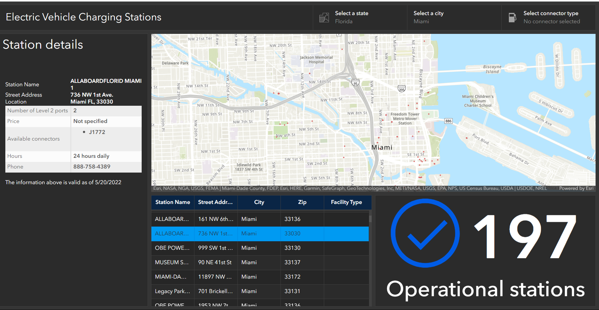

# 🚗🔌 ArcGIS Dashboard: Level 2 Electric Charging Stations in the US 🌎

Welcome to an interactive ArcGIS Dashboard that visualizes Level 2 Electric Charging Stations across the United States! ⚡🇺🇸

## Overview

This dashboard provides a comprehensive view of Level 2 electric vehicle charging stations in the US. It's designed to help you:

- Explore charging station locations 📍
- Analyze station usage trends 📊
- Plan your EV journey with ease 🗺️

## Features

🌟 **Interactive Map**: Navigate through the map to find charging stations near you.

📈 **Usage Analytics**: Get insights into usage patterns and peak hours.

🔌 **Real-time Availability**: Check the availability status of each station.

🛣️ **Route Planning**: Plan your trips with integrated directions to stations.

## Dashboard Preview

## How to Use

1. **Access Dashboard**: Open the [ArcGIS Level 2 Charging Stations Dashboard](https://nam02.safelinks.protection.outlook.com/?url=https%3A%2F%2Fwww.arcgis.com%2Fapps%2Fdashboards%2F4130e85d715b43d6a650b98cd1266e64&data=05%7C01%7Cjgyegyiri2023%40fau.edu%7C273c8ac17cd14c0312a708db9dd906eb%7C63c3c9c1e824413fb4352f0cabb2828f%7C0%7C0%7C638277327706460954%7CUnknown%7CTWFpbGZsb3d8eyJWIjoiMC4wLjAwMDAiLCJQIjoiV2luMzIiLCJBTiI6Ik1haWwiLCJXVCI6Mn0%3D%7C3000%7C%7C%7C&sdata=Br4b%2FXgE8n5xJbIwmlQ57FEHVFvWWORWtVPZx5J0ckI%3D&reserved=0).

2. **Explore Map**: Zoom and pan the map to find charging station markers.

3. **Station Details**: Click on a marker to view more information about the station.

4. **Usage Insights**: Analyze usage trends in the interactive graphs.

5. **Plan Your Route**: Click on 'Directions' to plan your route to a specific station.

## Data Sources

Our dashboard utilizes reliable data from [US Department of Energy's National Renewable Energy Laboratory (NREL)](https://services.arcgis.com/nzS0F0zdNLvs7nc8/arcgis/rest/services/Electric_Vehicle_Level_2_charging_stations_public_layer_view/FeatureServer) to provide you with up-to-date information.

## Feedback and Support

We're committed to improving your experience! If you have any feedback or encounter any issues, please [submit an issue](link_to_issues) in our repository.

## Contributing

We welcome contributions to enhance this dashboard. Please review our [contribution guidelines](link_to_contributing) for more details.

## Licensing

This project is under **no license**. You are free to use, modify, and distribute the code as per the terms.

---

Let's drive into the future together with sustainable transportation! 🌱⚡

